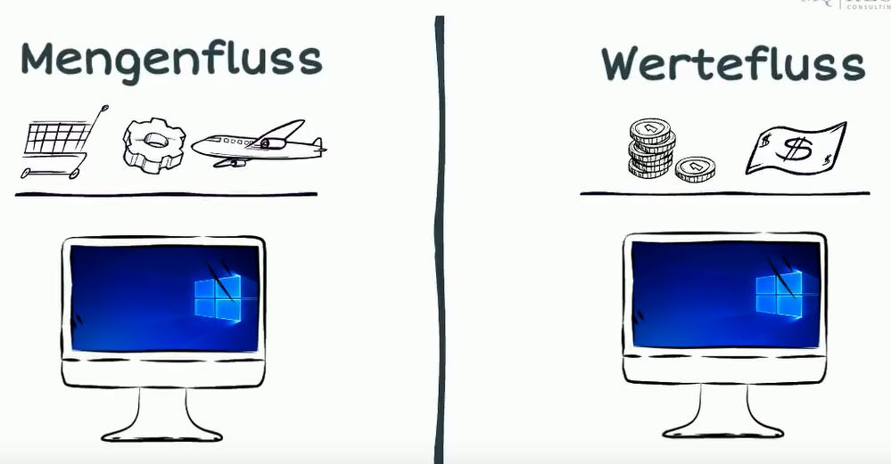
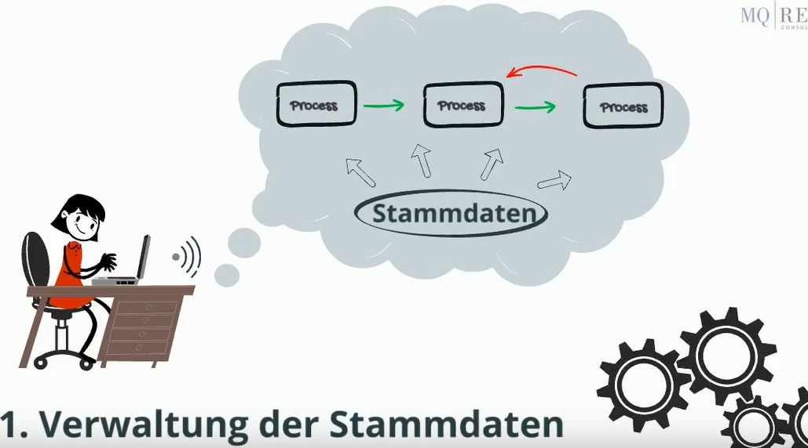

# ERP

ERP steht für Enterprise Resource Planing

Der Begriff betont die Fähigkeit die gesammten Resourcen eines Unternehmens integriert zu planen

Damit sorgt das System dafür, dass die Hauptprozesse eines Unternehmens, nämlich **verkaufen**, **produzieren** und
**beschaffen** völlig koordiniert ablaufen.

Ein Großteil der Mitarbeiter arbeitet mit dem ERP-System, aber für die meisten Mitarbeiter ist dieser
Begriff eher irreführend

Die meisten User beschäftigen sich nicht mit der Planung, sondern mit deren Umsetzung, sind
also operativ tätig.

Sie legen Aufträge an oder pflegen Kundenstammdaten, Preislisten oder Artikel

Damit verfügt eine ERP-System vor allem über Funktionen für die Durchführung von Geschäftsprocessen
und die Verwaltung von Stammdaten eines Unternehmens, die als Voraussetzung für die Durchführung
von Geschäftsprozessen erforderlich sind.

Der Begriff ERP betont daher eher eine strategische Eigenschaft, die aus der Sicht des Management von
immenser Bedeutung ist. Die meisten der abertausenden Funktionen eines ERP-Systems dienen aber der
Unterstützung der operativen Tätigkeiten.

Die vielen tausenden Funktionen lassen sich groß in 2 Bereiche teilen:
- Mengenfluss (die Unterstützung der logistischen Prozesse)
- Wertefluss (Finanzen)

In der Zeit vor ERP wurden Mengenfluss und Wertefluss noch von getrennten Systemen unterstützt

Der Einkäufer machte eine Bestellung eines Kunden in einem System und die Rechnung dafür wurde
in einem anderen System bearbeitet.

Relikte dieser historischen Trennung sind noch heute in ERP-Systemen zu finden. So wird
vom **Lieferanten** im Mengenflussbereich gesprochen und im Werteflussbereich vom **Kreditor**

Die Kombination von Mengenfluss und Wertefluss sind heute wesentlicher Bestandteil eines
ERP-Systems

Die meisten Funktionen eines ERP-Systems unterstützen operative Tätigkeiten, die man in 
2 Kategorien einteilen kann:
- Verwaltung von Stammdaten
- Durchführung von Kerngeschäftsprozessen (die Stammdaten sind Voraussetzung)

 

Die Stammdaten sind aber Voraussetzung für die Durchführung der Kerngeschäftsprozesse. 
So müssen daher vor einem Fertigungsprozess die Maschinen und das Personal in Form von
Arbeitsplätzen beschrieben werden und die für ein zu produzierendes Teil notwendigen
Resourcen in Form von Stücklisten und Arbeitsplänen vorhanden sein.

Sind diese Vorausetzungen in Form von vollständigen und aktuellen Stammdaten geschaffen, ermöglicht
dies die Durchführung der Kerngeschäftsprozesse, die somit den zweiten Bereich für ERP-User darstellen

Informationsträger für die Kerngeschäftsprozesse sind Aufträge:
- für das Produzieren sind dies die Fertigungsaufträge
- für das Beschaffen sind dies die Bestellaufträge
- für das Verkaufen die Kundenaufträge

Die dabei entstehenden Daten werden als Bewegungsdaten bezeichnet.

Zurück zu den Planungsfunktionen. Die Planungsmechanismen eines ERP-Systems stellen vor
allem sicher, dass die operativen Prozesse vollständig koordiniert ablaufen

Der Einkauf beschafft genau die Artikel die in der Produktion benötigt werden und die
Produktion fertigt genau die Artikel die aktuell verkauft werden.

Grundcharakter der Planung in ERP-Systemen ist es für einen Ausgleich von Angebot und
Nachfrage in allen Ebenen eines Unternehmens zu sorgen.

Dieses generelle Prinzip gilt bei der Planung
- des Materials
- der Fertigungsresourcen
- der Liquidität

Damit ermöglicht das ERP-System die Planung und Steuerung

Der Anspruch eines ERP-Systems ist es nicht nur eine rechtlich selbstständige Einheit
abzubilden, sondern ein Gesamtunternehmen. 
Schon ein mittleres Unternehmen enthält oft einige rechtliche Einheiten:
- z.B. eine Muttergesellschaft in Deutschland
- Produktionsgesellschaften in Rumänien und China
- Europa oder Weltweit verteilte Vertriebsgesellschaften

ERP-Systeme sind in der Lage verschiedene Unternehmensformen in verschiedenen Ländern
abzubilden. 
Typische Funktionalitäten sind daher:
- Mehrwährungsfähigkeiten
- Mehrsprachigkeit
- Konsolidierung
- Intercompany Prozessabwicklung

Der heutige Umfang der Systeme und die daraus resultierende Komplexität ist Segen und Fluch
zugleich.

## Links
- [https://www.youtube.com/watch?v=sG5Ovxu71cU](https://www.youtube.com/watch?v=sG5Ovxu71cU)
- [https://www.youtube.com/watch?v=mc8A4sGnYBY](https://www.youtube.com/watch?v=mc8A4sGnYBY)
- [https://www.youtube.com/watch?v=UC1czfAo_NM](https://www.youtube.com/watch?v=UC1czfAo_NM)
- [https://www.udemy.com/course/erp-einfuehrung-erfolgreich-diese-basics-musst-du-kennen/](https://www.udemy.com/course/erp-einfuehrung-erfolgreich-diese-basics-musst-du-kennen/)
- [https://www.sap.com/austria/products/erp/what-is-erp.html](https://www.sap.com/austria/products/erp/what-is-erp.html)
- [https://www.youtube.com/watch?v=ZuDOIUQYePI](https://www.youtube.com/watch?v=ZuDOIUQYePI)
