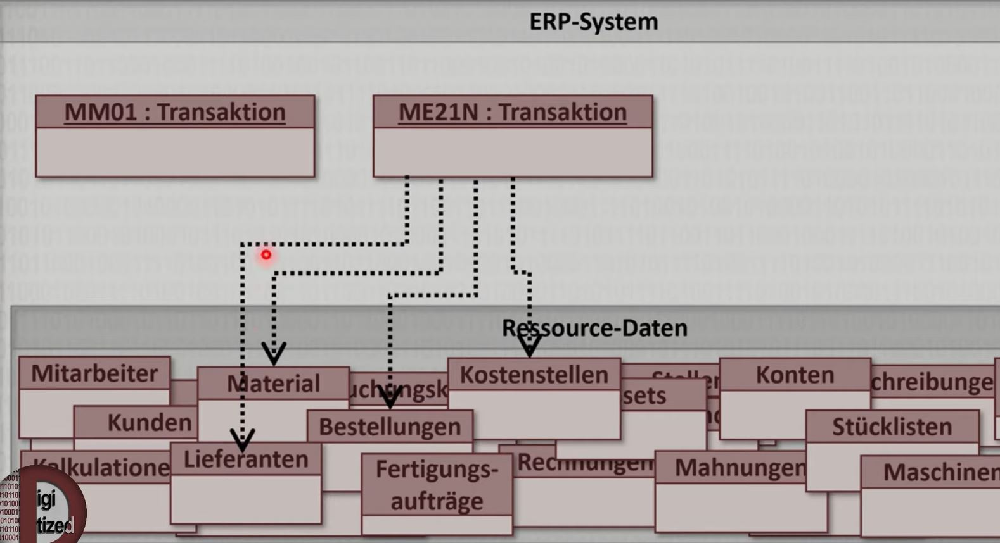

# SAP Grundlagen

## ERP-System

[https://www.youtube.com/watch?v=ZuDOIUQYePI](https://www.youtube.com/watch?v=ZuDOIUQYePI)

ERP steht für Enterprise Resource Planning --> alle Resourcen eines Unternehmens ganzheitlich zu verwalten
bzw. zu planen.

Resourcen sind
- Finanzen (Ausgaben und Einnahmen, ...)
- Personen (Kunden, Lieferanten, Mitarbeiter, ...)
- Materialien (Produkte, Rohstoffe, ...)
- Maschinen die für die Wertschöpfung notwendig sind

Meist ist es so, dass wenn sich nur eine dieser Resourcen verändert, dann hat das auch Auswirkungen auf viele andere Resourcen

Auch wenn dies ziemlich komplex klingt, so sind ERP-Systeme ziemlich einfach aufgebaut.
- große Datenbank die alle Resourcendaten (Mitarbeiter, Kunden, Lieferanten, Material, Bestellungen, Rechnungen, Kostenstellen,
  Stücklisten, ...)  speichert
- Transaktionen (kleine Unterprogramme innerhalb eines ERP-Systems

## Transaktionen

sind kleine Unterprogramme innerhalb eines ERP-Systems (es gibt viele davon). Jede Einzelne spiegelt
genau einen Prozessschritt in einem Unternehmen wieder und greift auf die jeweiligen Daten zu. 
Z.B. gibt es in SAP die Transaktion MM01 die nur für das Anlegen von neuem Material da ist

Möchte man dieses Material dann auch bestellen müsste man dann auch eine Bestellung anlegen (ME21N Transaktion)

So gibt es jede Menge weiterer Transaktionen

Viele stören sich in SAP an diesen komischen scheinbar willkürlichen Transaktionsnamen/kürzel (z.B. MM01, ME21N, ...).
Diese sind auch ziemlich ungeeignet um die Menge der Transaktionen zu überblicken. In SAP bibt es dafür eine Baumstruktur
die alle Transaktionen systematisch gliedert. Versteht man diesen Baum, so versteht man SAP

z.B. Pflege von Materialdaten

z.B. Anzeigen des Materials

z.B. einen Kugelschreiber mit der Materialnummer 1172 anzeigen

Man muss natürlich diese Materialnummer nicht auswendig wissen. SAP hat immer ein ausgeklügeltes Suchsystem eingebaut

Nach der Auswahl des Materials bekommt die unterschiedlichen Sichten der Stammdaten

Ein Eintrag in den Stammdaten heißt noch nicht dass dieses Material im Unternehmen vorhanden ist. Dies ist die Aufgabe
der Bewegungsdaten 

## Stamm-/Bewegungsdaten

Stammdaten:

Bewegungsdaten: 
Die auf den Stammdaten basierenden Daten wie Bestellungen, Fertigungsaufträge, Lagerbestände, Auslieferung, ...
nennt man Bewegungsdaten. Diese Daten beleben also das Unternehmen

